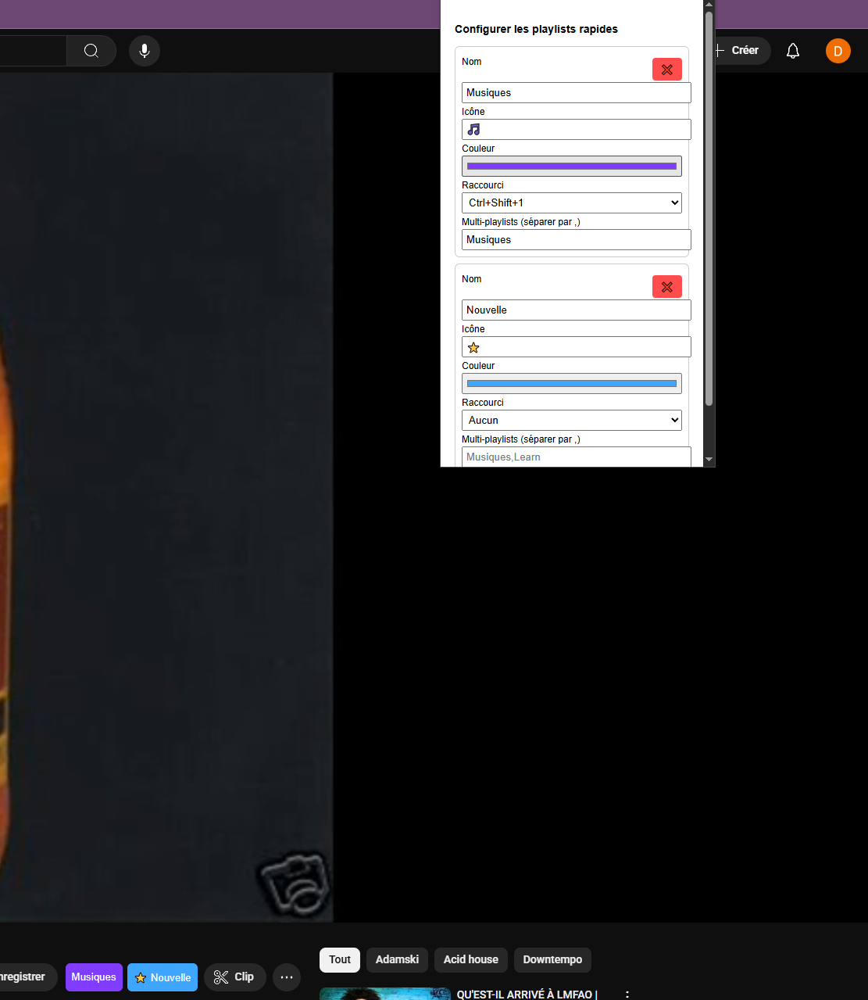

# YouTube Quick Save 🎵

[](https://chrome.google.com/webstore)
[](https://github.com/your-username/auto-add-in-playlist-youtube)
[](LICENSE)

> **English** | [Français](#youtube-quick-save-1)

A powerful Chrome extension that adds quick save buttons and keyboard shortcuts to instantly add YouTube videos to your playlists. Save time and organize your content efficiently!

## ✨ Features

- 🚀 **Quick Save Buttons**: Add videos to playlists with one click
- ⌨️ **Keyboard Shortcuts**: Use Ctrl+Shift+1 to 4 for instant saving
- 🎨 **Customizable Playlists**: Configure your own playlists with icons and colors
- 🔄 **Multi-Playlist Support**: Add to multiple playlists simultaneously
- 💾 **Sync Across Devices**: Your settings are saved in Chrome sync
- 🎯 **Smart Detection**: Automatically detects YouTube video pages

## 🖼️ Screenshots



## 🚀 Installation

### Option 1: Chrome Web Store (Recommended)

1. Visit the Chrome Web Store
2. Search for "YouTube Quick Save"
3. Click "Add to Chrome"
4. Confirm the installation

### Option 2: Manual Installation

1. Download or clone this repository
2. Open Chrome and go to `chrome://extensions/`
3. Enable "Developer mode" (top right toggle)
4. Click "Load unpacked"
5. Select the extension folder

## ⚙️ Configuration

1. **Open the extension popup** by clicking the extension icon in your toolbar
2. **Add your playlists**:
   - Click "➕ Ajouter une playlist" (Add a playlist)
   - Configure each playlist:
     - **Name**: The exact name of your YouTube playlist
     - **Icon**: Choose an emoji or symbol (e.g., 🎵, ⭐, 🎬)
     - **Color**: Pick a custom color for the button
     - **Shortcut**: Assign a keyboard shortcut (Ctrl+Shift+1 to 4)
     - **Multi-playlists**: Add additional playlists (separate with commas)

## 🎮 Usage

### Using Quick Save Buttons

1. Navigate to any YouTube video
2. Look for the quick save buttons below the video
3. Click any button to instantly add the video to that playlist

### Using Keyboard Shortcuts

- **Ctrl+Shift+1**: Add to playlist 1
- **Ctrl+Shift+2**: Add to playlist 2
- **Ctrl+Shift-3**: Add to playlist 3
- **Ctrl+Shift-4**: Add to playlist 4

### Multi-Playlist Saving

Configure a playlist with additional playlists in the "Multi-playlists" field to add videos to multiple playlists at once.

## 🔧 Troubleshooting

### Extension not working?

1. **Refresh the page**: Sometimes YouTube's interface changes
2. **Check permissions**: Ensure the extension has access to YouTube
3. **Verify playlist names**: Make sure playlist names match exactly
4. **Clear cache**: Try clearing browser cache and cookies

### Buttons not appearing?

1. **Wait for page load**: The extension needs time to detect the video
2. **Check URL**: Ensure you're on a YouTube video page (`/watch`)
3. **Reload extension**: Go to `chrome://extensions/` and reload the extension

### Keyboard shortcuts not working?

1. **Check conflicts**: Other extensions might use the same shortcuts
2. **Verify assignment**: Ensure shortcuts are assigned in the popup
3. **Focus**: Make sure the YouTube tab is active

## 🤝 Contributing

We welcome contributions! Here's how you can help:

1. **Fork** the repository
2. **Create** a feature branch (`git checkout -b feature/amazing-feature`)
3. **Commit** your changes (`git commit -m 'Add amazing feature'`)
4. **Push** to the branch (`git push origin feature/amazing-feature`)
5. **Open** a Pull Request

### Development Setup

```bash
# Clone the repository
git clone https://github.com/your-username/auto-add-in-playlist-youtube.git

# Navigate to the project
cd auto-add-in-playlist-youtube

# Load in Chrome
# 1. Open chrome://extensions/
# 2. Enable Developer mode
# 3. Click "Load unpacked"
# 4. Select this folder
```

## 📝 License

This project is licensed under the MIT License - see the [LICENSE](LICENSE) file for details.

## 🙏 Acknowledgments

- YouTube for their platform
- Chrome Extensions API
- All contributors and users

---

---

# YouTube Quick Save 🎵

[](https://chrome.google.com/webstore)
[](https://github.com/your-username/auto-add-in-playlist-youtube)
[](LICENSE)

> [English](#youtube-quick-save) | **Français**

Une extension Chrome puissante qui ajoute des boutons de sauvegarde rapide et des raccourcis clavier pour ajouter instantanément des vidéos YouTube à vos playlists. Gagnez du temps et organisez votre contenu efficacement !

## ✨ Fonctionnalités

- 🚀 **Boutons de Sauvegarde Rapide** : Ajoutez des vidéos aux playlists en un clic
- ⌨️ **Raccourcis Clavier** : Utilisez Ctrl+Shift+1 à 4 pour sauvegarder instantanément
- 🎨 **Playlists Personnalisables** : Configurez vos propres playlists avec icônes et couleurs
- 🔄 **Support Multi-Playlists** : Ajoutez à plusieurs playlists simultanément
- 💾 **Synchronisation** : Vos paramètres sont sauvegardés dans Chrome sync
- 🎯 **Détection Intelligente** : Détecte automatiquement les pages de vidéos YouTube

## 🖼️ Captures d'écran


## 🚀 Installation

### Option 1 : Chrome Web Store (Recommandé)

1. Visitez le Chrome Web Store
2. Recherchez "YouTube Quick Save"
3. Cliquez sur "Ajouter à Chrome"
4. Confirmez l'installation

### Option 2 : Installation Manuelle

1. Téléchargez ou clonez ce repository
2. Ouvrez Chrome et allez à `chrome://extensions/`
3. Activez le "Mode développeur" (interrupteur en haut à droite)
4. Cliquez sur "Charger l'extension non empaquetée"
5. Sélectionnez le dossier de l'extension

## ⚙️ Configuration

1. **Ouvrez le popup de l'extension** en cliquant sur l'icône dans votre barre d'outils
2. **Ajoutez vos playlists** :
   - Cliquez sur "➕ Ajouter une playlist"
   - Configurez chaque playlist :
     - **Nom** : Le nom exact de votre playlist YouTube
     - **Icône** : Choisissez un emoji ou symbole (ex : 🎵, ⭐, 🎬)
     - **Couleur** : Choisissez une couleur personnalisée pour le bouton
     - **Raccourci** : Assignez un raccourci clavier (Ctrl+Shift+1 à 4)
     - **Multi-playlists** : Ajoutez des playlists supplémentaires (séparées par des virgules)

## 🎮 Utilisation

### Utilisation des Boutons de Sauvegarde Rapide

1. Naviguez vers n'importe quelle vidéo YouTube
2. Cherchez les boutons de sauvegarde rapide sous la vidéo
3. Cliquez sur n'importe quel bouton pour ajouter instantanément la vidéo à cette playlist

### Utilisation des Raccourcis Clavier

- **Ctrl+Shift+1** : Ajouter à la playlist 1
- **Ctrl+Shift+2** : Ajouter à la playlist 2
- **Ctrl+Shift+3** : Ajouter à la playlist 3
- **Ctrl+Shift+4** : Ajouter à la playlist 4

### Sauvegarde Multi-Playlists

Configurez une playlist avec des playlists supplémentaires dans le champ "Multi-playlists" pour ajouter des vidéos à plusieurs playlists à la fois.

## 🔧 Dépannage

### L'extension ne fonctionne pas ?

1. **Actualisez la page** : L'interface YouTube change parfois
2. **Vérifiez les permissions** : Assurez-vous que l'extension a accès à YouTube
3. **Vérifiez les noms de playlists** : Assurez-vous que les noms correspondent exactement
4. **Videz le cache** : Essayez de vider le cache et les cookies du navigateur

### Les boutons n'apparaissent pas ?

1. **Attendez le chargement** : L'extension a besoin de temps pour détecter la vidéo
2. **Vérifiez l'URL** : Assurez-vous d'être sur une page de vidéo YouTube (`/watch`)
3. **Rechargez l'extension** : Allez à `chrome://extensions/` et rechargez l'extension

### Les raccourcis clavier ne fonctionnent pas ?

1. **Vérifiez les conflits** : D'autres extensions pourraient utiliser les mêmes raccourcis
2. **Vérifiez l'assignation** : Assurez-vous que les raccourcis sont assignés dans le popup
3. **Focus** : Assurez-vous que l'onglet YouTube est actif

## 🤝 Contribuer

Nous accueillons les contributions ! Voici comment vous pouvez aider :

1. **Forkez** le repository
2. **Créez** une branche de fonctionnalité (`git checkout -b feature/fonctionnalite-geniale`)
3. **Commitez** vos changements (`git commit -m 'Ajouter une fonctionnalité géniale'`)
4. **Poussez** vers la branche (`git push origin feature/fonctionnalite-geniale`)
5. **Ouvrez** une Pull Request

### Configuration de Développement

```bash
# Clonez le repository
git clone https://github.com/your-username/auto-add-in-playlist-youtube.git

# Naviguez vers le projet
cd auto-add-in-playlist-youtube

# Chargez dans Chrome
# 1. Ouvrez chrome://extensions/
# 2. Activez le Mode développeur
# 3. Cliquez sur "Charger l'extension non empaquetée"
# 4. Sélectionnez ce dossier
```

## 📝 Licence

Ce projet est sous licence MIT - voir le fichier [LICENSE](LICENSE) pour plus de détails.

## 🙏 Remerciements

- YouTube pour leur plateforme
- Chrome Extensions API
- Tous les contributeurs et utilisateurs
